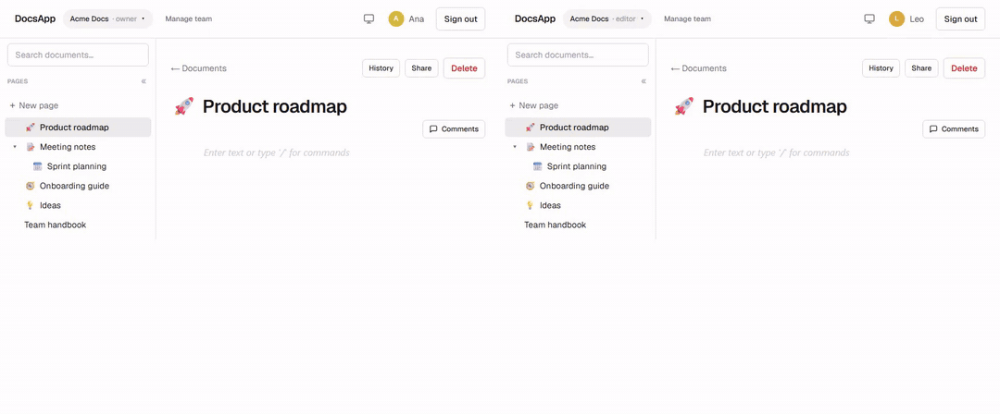
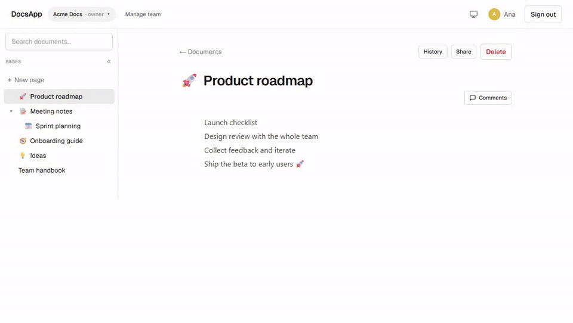
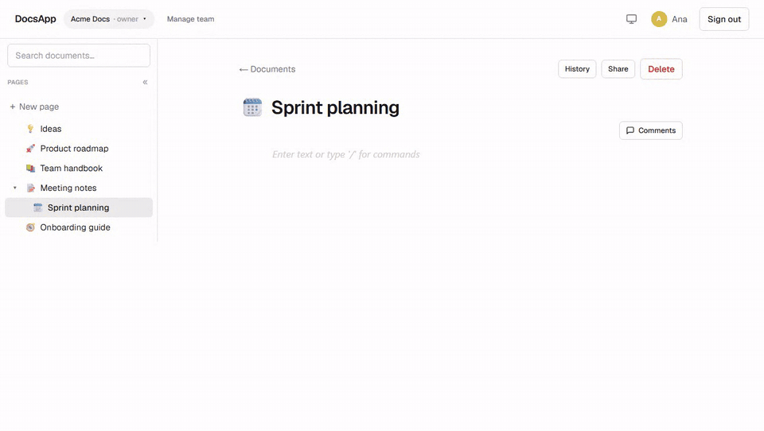

# DocsApp

A Notion-style **real-time collaborative docs app** for small teams — built on Next.js 16 and Supabase,
with row-level multi-tenancy, CRDT collaboration over the team's own infrastructure (no third-party
realtime vendor), and token-based team invitations.

> **Live demo:** https://docs-app-orcin.vercel.app
> **Stack:** Next.js 16 (App Router, RSC, Server Actions) · React 19 · TypeScript (strict) · Tailwind v4 ·
> Supabase (Postgres + Auth + RLS + Realtime) · Yjs · BlockNote

---

## See it in action

**Real-time collaboration** — two users on the same document, with named live cursors, synced by Yjs
(CRDT) over Supabase Realtime:



**Notion-style organization** — reorder pages with drag & drop in the sidebar and give each page its
own emoji:



**Version history with non-destructive restore** — every editing burst leaves a snapshot; preview any
version and restore it (the current state is checkpointed first, and the restore lands live in open
editors):



---

## Features

- 🔐 **Auth** — email/password and **Google OAuth** (PKCE), with automatic identity linking by email.
- 🏢 **Multi-tenant** — teams, memberships and documents fully isolated by **Row-Level Security**.
- ✍️ **Rich-text editor** — Notion-style block editor (BlockNote) with autosave.
- 👥 **Real-time collaboration** — multiple people edit the same document live, with cursors, powered by
  **Yjs (CRDT) over Supabase Realtime** — no Liveblocks / PartyKit / dedicated WebSocket server.
- 📨 **Team management** — invite by email (token link), accept flow, role management (owner / admin /
  editor / viewer), and a multi-team switcher.
- 🔌 **REST API** — `/api/v1` for local projects: CRUD documents across your teams with a Bearer token,
  read/write **Markdown** or JSON, and edits that broadcast **live** to open editors. See
  [`docs/API.md`](docs/API.md).
- 🕘 **Version history** — every editing burst leaves a coalesced snapshot (DB trigger over the Yjs
  state, capped per doc). Browse, preview and **restore non-destructively**: the current state is
  checkpointed first and the restore lands **live** in open editors via the same CRDT delta pipeline
  the API uses.
- 📅 **Team calendars** — events and deadlines per team, a personal month view across all your teams
  (one colour per team), and optional **two-way Google Calendar sync**: a team owner hosts the team
  calendar in their Google account, members can add it to theirs, and what anyone creates on either
  side shows up on the other. See [Google Calendar sync](#google-calendar-sync).

## Architecture highlights

These are the parts worth reading the code for:

### Multi-tenant security without recursion
RLS is the single source of truth for authorization. Policies on `teams` / `memberships` / `documents`
delegate to `SECURITY DEFINER` helper functions in a non-exposed `private` schema
(`is_team_member`, `has_min_role`, …). This sidesteps the classic *"infinite recursion in policy on
`memberships`"* problem: a policy that subqueries its own table would re-trigger itself, so the lookups
run inside definer functions instead. Bootstrapping the first team uses an atomic RPC
(`create_team_with_owner`) to resolve the chicken-and-egg of "you must be an admin to insert a
membership, but you have none yet". See [`supabase/apply_all.sql`](supabase/apply_all.sql).

### CRDT collaboration on your own infrastructure
Instead of a managed realtime vendor, collaboration runs on a hand-built Yjs provider
([`lib/yjs/supabase-provider.ts`](lib/yjs/supabase-provider.ts)) over a **private Supabase Realtime
channel** per document:
- **Liveness** — local Yjs updates are broadcast and applied to peers.
- **Convergence** — Broadcast is at-most-once, so a dropped update would diverge forever. The provider
  runs the y-protocols **sync handshake (state-vector → diff)** on every (re)subscribe *and periodically*
  as anti-entropy, healing any lost update and late joiners.
- **Durability** — a single *elected* peer persists the Yjs snapshot to Postgres with **optimistic
  concurrency (read → `mergeUpdates` → CAS update)**, so concurrent writers converge instead of
  clobbering each other. A `pagehide` beacon flushes the last edits on tab close.
- **Authorization** — the channel is gated by **Realtime Authorization** (RLS on `realtime.messages`):
  team members receive, only editors+ can broadcast (viewers are read-only at the transport layer), and
  cross-team access is denied.

### Token-based invitations
Admins create an invitation (email + role + expiry) and get a copyable link. The invitee's read/accept
paths go through `SECURITY DEFINER` RPCs (the `invitations` table itself is admin-only), so there's no
email enumeration and `auth.users` is never exposed. Accepting is idempotent, single-use, and never
grants `owner`. `?next` is preserved through login/signup and sanitized against open-redirects.

### Google Calendar sync
Each team gets **one** Google calendar, created as a secondary calendar in the account of the **owner who
hosts it** (`team_calendar_links`), so nobody ends up with calendars for teams they merely belong to.
Members who connect their own Google can ask to *see it in my Google*: DocsApp shares the host's
calendar with their verified Google email through Google's ACL API, using the host's token. Refresh
tokens are stored **AES-256-GCM encrypted** (`GOOGLE_TOKEN_ENC_KEY`) and only ever decrypted on the
server. Sync is two-way and runs on demand: opening a calendar pulls changes **incrementally**
(`syncToken`, throttled to once a minute, plus a *Sync now* button) and pushes rows that were never
uploaded or were edited after their last sync. Any member may trigger it even though it uses the host's
credentials: the RLS-sensitive steps (`get_team_calendar_credentials`, `apply_google_sync`,
`mark_event_synced`) are `SECURITY DEFINER` RPCs gated by team membership, and the credentials RPC only
ever returns ciphertext. A loop guard (`google_updated_at`) stops our own pushes from being re-imported.
No `googleapis` dependency: the client is a thin `fetch` wrapper.

### REST API for local tooling
A versioned REST API (`/api/v1`) lets an external project operate your docs programmatically, authenticated
with the **same account and RLS** as the web app — an `Authorization: Bearer <jwt>` header is forwarded to
PostgREST, so team roles gate every call (no parallel authorization logic). Highlights:
- **Markdown as the API format, Yjs as the source of truth.** Reads derive Markdown from the blocks; writes
  parse Markdown → blocks and merge a **Yjs delta** into the document's CRDT through the same CAS+merge path
  as the editor — real-time collaboration is never bypassed.
- **Live edits** — an API write broadcasts its Yjs update on the document's Realtime channel, so anyone with
  the doc open sees it apply **without reloading**.
- Endpoints: `GET /teams`, `GET·POST /teams/{teamId}/documents`, `GET·PATCH·DELETE /documents/{id}`
  (`?format=markdown|json`). Full reference + example client in [`docs/API.md`](docs/API.md).

## Tech stack

| Layer | Choice |
|---|---|
| Framework | Next.js 16 (App Router, Server Components, Server Actions, Turbopack) |
| Language | TypeScript (strict) |
| UI | React 19, Tailwind CSS v4, BlockNote (Mantine) |
| Editor / CRDT | BlockNote + Yjs + y-protocols |
| Backend | Supabase — Postgres, Auth, Row-Level Security, Realtime |
| Auth | `@supabase/ssr` (cookie sessions, PKCE) |

> Note: in Next.js 16 the middleware file is `proxy.ts` (not `middleware.ts`); it refreshes the Supabase
> session and guards routes.

## Running locally

**Prerequisites:** Node 20+ and a Supabase project (free tier is fine).

1. **Install**
   ```bash
   npm install
   ```
2. **Apply the database schema** — run [`supabase/apply_all.sql`](supabase/apply_all.sql) once in your
   Supabase project's SQL Editor (tables, RLS, helper functions, RPCs, Realtime Authorization policies).
   In **Settings → API**, keep only `public` in *Exposed schemas*.
3. **Environment** — create `.env.local`:
   ```bash
   NEXT_PUBLIC_SUPABASE_URL=https://<your-project>.supabase.co
   NEXT_PUBLIC_SUPABASE_ANON_KEY=<your-anon-key>
   # optional (used for OAuth/email redirect origin in some flows)
   NEXT_PUBLIC_SITE_URL=http://localhost:3000
   ```
4. **(Optional) Google sign-in** — enable the Google provider in Supabase Auth and add your app's
   `/auth/callback` to the redirect allowlist.
5. **(Optional) Google Calendar sync** — in Google Cloud Console enable the **Google Calendar API** and
   add `<NEXT_PUBLIC_SITE_URL>/auth/google-calendar/callback` as an authorized redirect URI of an OAuth
   client (the one used for Supabase sign-in works). Then add to `.env.local`:
   ```bash
   GOOGLE_OAUTH_CLIENT_ID=<oauth-client-id>
   GOOGLE_OAUTH_CLIENT_SECRET=<oauth-client-secret>
   # 32 random bytes, base64 — encrypts refresh tokens at rest
   GOOGLE_TOKEN_ENC_KEY=$(node -e "console.log(require('crypto').randomBytes(32).toString('base64'))")
   ```
   Without these the app still works; the profile page just reports the integration as not configured.
6. **Run**
   ```bash
   npm run dev
   ```
   Open http://localhost:3000.

**Scripts:** `npm run dev` · `npm run build` · `npm run lint` · `npm test` · `npm run test:e2e`.

## Testing

Two layers:

- **Unit / integration — [Vitest](https://vitest.dev):** pure logic with no external infra, runs in CI.
  Covers the open-redirect sanitizer (`safeNext`), the document tree builder (`buildDocTree` /
  `collectDescendantIds`), i18n interpolation (`fmt`), the Yjs base64 encoding + CRDT merge
  (commutative / idempotent), the API's Markdown ↔ blocks round-trip (jsdom), and the calendar's
  date math, Google event mapping and token encryption.
  ```bash
  npm test          # run once
  npm run test:watch
  ```
- **End-to-end — [Playwright](https://playwright.dev):** critical flows in a real browser against the dev
  server. Covers login → create document → title persists across reload → delete, the dark-mode toggle
  (`data-theme` changes and persists), and the team calendar (create → edit → delete an event). Needs a test account — copy `.env.test.example` to `.env.test` and
  fill it in:
  ```bash
  npx playwright install chromium   # once
  npm run test:e2e
  ```

## Project structure

```
app/                 # routes (App Router)
  (app)/             # authenticated area: docs, teams, invite, layout
  api/v1/            # public REST API (Bearer auth): teams, documents
  auth/callback/     # OAuth / email-confirmation PKCE callback
  login, signup/     # auth pages
components/          # client components (editor, members, invites, switcher…)
lib/
  supabase/          # browser/server/proxy/api Supabase clients
  yjs/               # Yjs provider, encoding, CAS persistence
  api/               # REST API: auth, responses, markdown<->blocks, doc-body, broadcast
  teams.ts, auth/    # team helpers, safe-redirect
scripts/             # example API clients (api-smoke, api-patch)
tests/unit/          # Vitest unit/integration tests
e2e/                 # Playwright end-to-end tests
supabase/
  migrations/        # incremental SQL migrations
  apply_all.sql      # combined schema (apply once on a fresh project)
proxy.ts             # Next.js 16 middleware (session refresh + route guard)
```

## Status

Built in phases: **0** auth + multi-tenant + RLS · **1** rich-text editor · **2** real-time
collaboration (Yjs over Supabase Realtime) · **3** teams + invitations · **+** Google OAuth · **6** user
profiles · **7** REST API (`/api/v1`, Bearer auth, Markdown, live edits) · plus full-text search, trash
with restore, public share links, inline comments, drag & drop page organization, **version history
with non-destructive restore** and **team calendars with Google Calendar sync**. Core is feature-complete; deployed on Vercel against Supabase.
